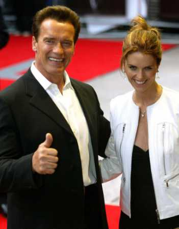
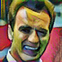
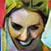

# FaceStyle

This is a project combined with face detection and face neural style transfer.

Face detection stage is an implementation of YOLO v2 for face detection based on <a href="https://github.com/abars/YoloKerasFaceDetection">YoloKerasFaceDetection by abars</a>.
Face neural style transfer stage is heavily inspired from <a href="https://github.com/titu1994/Fast-Neural-Style">Fast-Neural-Style by titu1994</a>.

    python main.py -s la_muse -i ./pic/img_1302.jpg

The detected face(s) will be saved under "face" folder and the stylized face picture will be save under "transferred" folder.

Some pretrained models are saved under /styleTransfer/pretrained and the images for training style are saved in folders under /styleTransfer/images/train/.

Train a YOLO v2 for face detection using FDDB as training:

    cd ./faceDetection/train_yolov2/
    python train.py

Train a style (style images should be save in a folders under /styleTransfer/images/train/:

    python train.py -s la_muse
    
The weights saved from style training will be saved under the current directory.

Some Examples:

